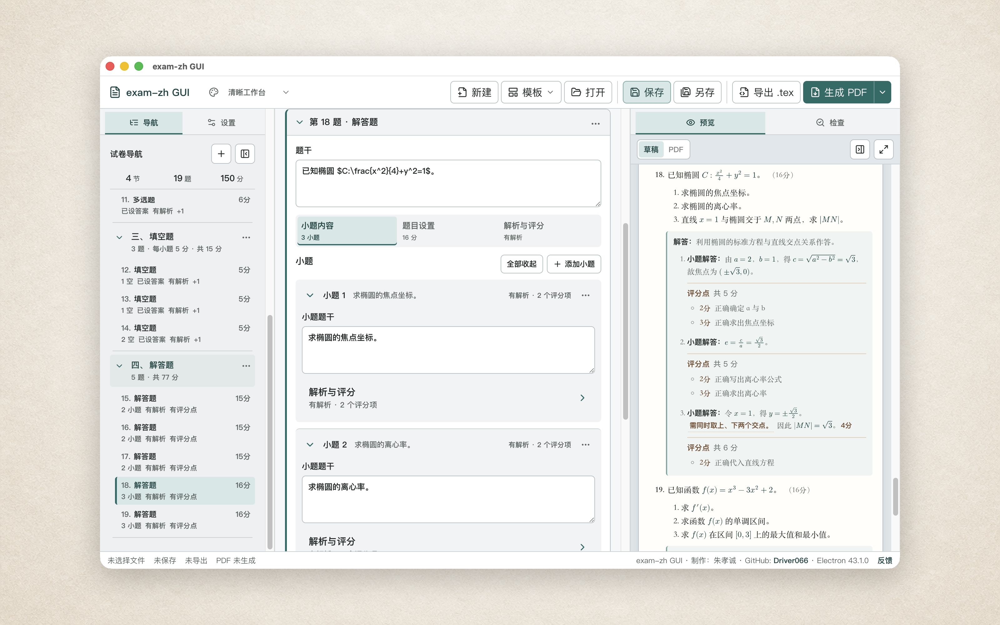
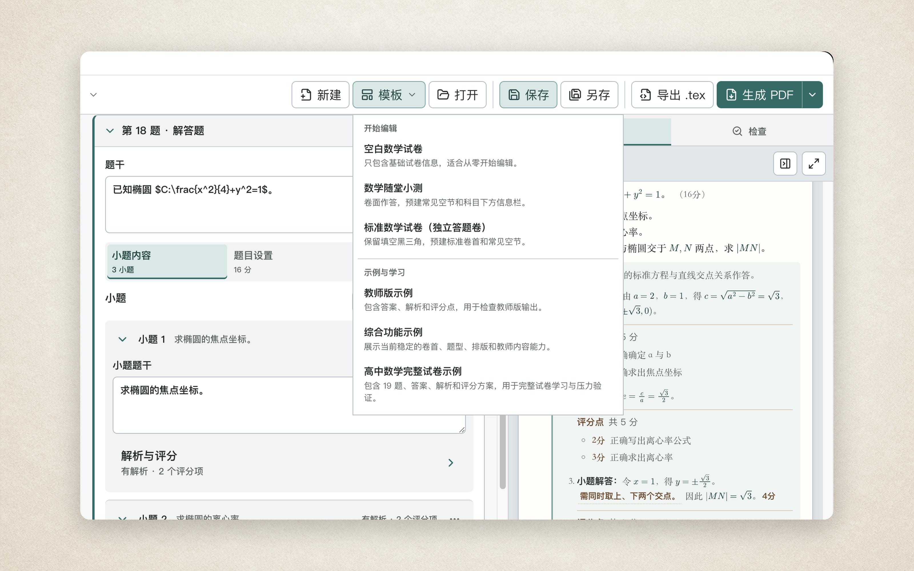
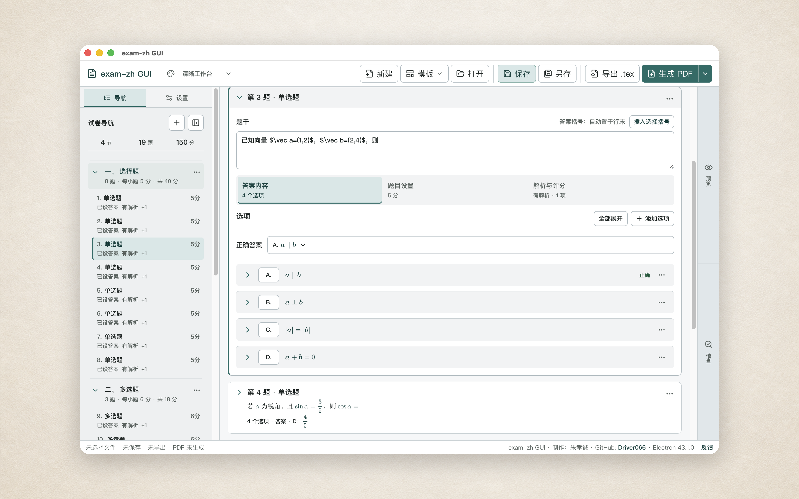
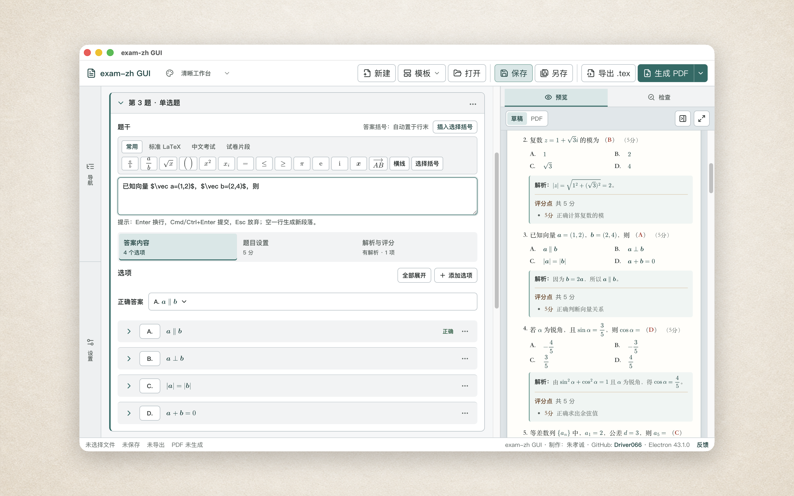
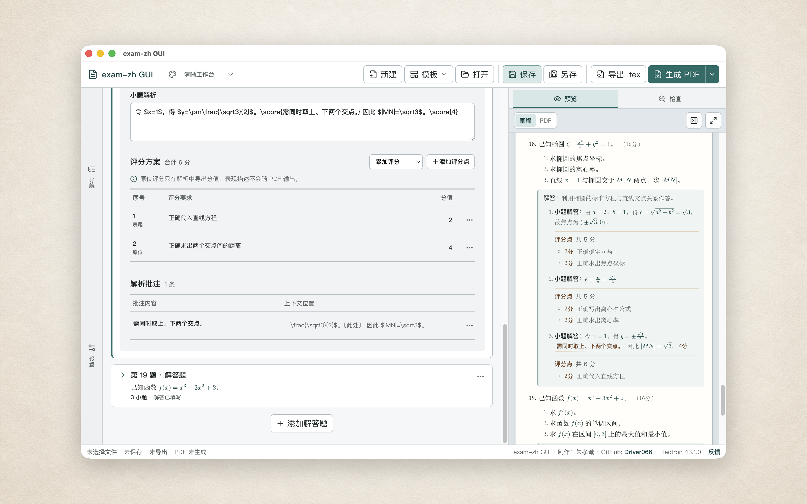
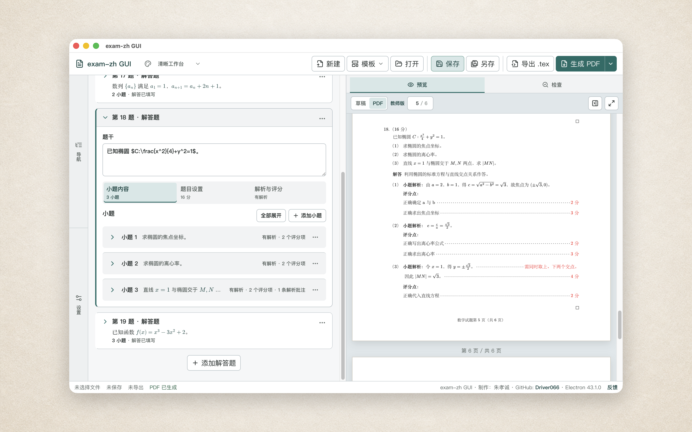
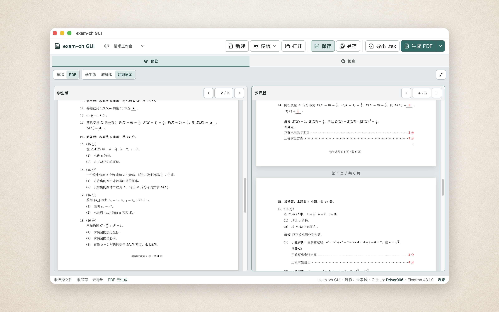

# exam-zh GUI

一款面向中学教师的结构化中文试卷编辑器：在图形界面中编写题目、答案、解析和评分方案，再导出基于 [`exam-zh`](https://github.com/xkwxdyy/exam-zh) 的 `.tex` 与 PDF。

> 当前状态：开发预览。数学试卷的核心编辑和输出流程已经可以体验。建议先从示例或试卷副本开始，并始终保留 `.examzh.json` 源文件。

## 不必从一整份 LaTeX 代码开始

`exam-zh` 提供了专业的中文试卷排版能力，但直接维护整份 LaTeX 对不熟悉命令和环境的教师并不轻松。exam-zh GUI 把常用内容拆成可编辑的试卷对象：节、题目、选项、填空、小题、答案、解析和评分项。

教师面对的是试卷结构，应用负责把这些结构转换为 `exam-zh` 源码。草稿预览用于随时检查内容，真实 PDF 仍由 LaTeX 编译，避免把网页近似效果误当成最终排版。

## 从合适的模板开始

应用目前内置六个数学模板。

“开始编辑”适合直接创建新试卷：

- 空白数学试卷；
- 数学随堂小测；
- 标准数学试卷（独立答题卷）。

“示例与学习”用于熟悉已有能力：

- 教师版示例；
- 综合功能示例；
- 高中数学完整试卷示例。

起步模板只准备可以直接填写的空节，不放需要逐题删除的占位内容。完整数学试卷示例包含 4 节、19 题、150 分，同时展示卷首信息、选择题、填空题、判断题、解答题、答案、解析和评分方案。

## 结构化编辑一份试卷

当前编辑器支持：

- 新建、打开、保存和另存试卷；
- 编辑标题、科目、年级、学期、考试时间、总分与卷首信息；
- 添加单选题、多选题、填空题、判断题和解答题；
- 添加、移动、复制和删除节、题目、选项与小题；
- 设置题号连续性、起始序号和常用题号样式；
- 调整选择题列数、标签和常用排版选项；
- 设置填空留白、连续编号、括号、框线与教师答案颜色；
- 使用学生版、教师版或双版本输出。

左侧工作台用于导航和整卷设置，中央区专注当前节和题目，右侧用于草稿、PDF 与问题检查。窗口较窄时，左右工作台仍与中央编辑区平行，不会覆盖正在输入的内容。

## 为数学试卷准备的输入工具

题干、选项、填空答案、解析和小题都可以输入普通文字与数学公式。数学工具条区分常用、标准 LaTeX、中文考试、试卷片段和最近使用，并根据当前输入位置隐藏不合适的内容。

结构化公式片段已经覆盖：

- `\frac` 与 `\dfrac` 分子、分母双槽；
- 自动尺寸圆括号、方括号、花括号和绝对值；
- 上标与下标槽位；
- 单字母粗体向量和多字母箭头向量；
- Tab 与 Shift+Tab 槽位导航。

应用内公式由本地 MathJax 即时预览；无法完整预览的命令仍会保留原始输入，最终效果以导出的 LaTeX PDF 为准。

## 答案、解析与评分放在同一份源文件里

学生版隐藏答案、解析和评分内容；教师版显示选择答案、填空答案、判断答案、整题与小题解析，以及结构化评分方案。

评分方案支持两种常见方式：

- 累加评分点：各步骤分值相加；
- 互斥评分档：按最高满足档位给分。

解析中还可以加入原位评分项和不参与合计的批注。分值、答案或评分设置存在问题时，应用会在导航和“检查”工作台中提示，但不会擅自改写教师内容。

## 草稿校对与真实 PDF

右侧草稿会跟随正在输入的内容更新，适合快速检查题号、选项、答案和结构。它不模拟真实分页、页眉页脚或 XeLaTeX 字体指标。

生成 PDF 时，应用会自动选择可用的排版方式：

- 设备已经安装 LaTeX 时，优先使用本机 XeLaTeX；
- 没有本机 TeX 环境时，可以使用应用内置的 Tectonic；
- 一次生成学生版、教师版或两份版本；
- 在应用内阅读 PDF，并查看编译警告、错误和原始日志。

完整数学试卷已经分别通过系统 XeLaTeX 和应用内置的 Tectonic 生成学生版 3 页、教师版 6 页，并能在应用内完整阅读。首次使用内置排版方式时可能需要联网准备 TeX 资源，当前版本尚不保证完全离线。

需要集中校对时，可以把预览展开为专注模式。同时生成学生版和教师版后，也可以并排查看两份 PDF，并分别翻页核对。

## 请保留 `.examzh.json` 源文件

exam-zh GUI 使用三类文件，但它们的职责不同：

| 文件           | 用途                                                   |
| -------------- | ------------------------------------------------------ |
| `.examzh.json` | 唯一可靠的可编辑源文件，保存试卷结构、答案、解析和设置 |
| `.tex`         | 供 LaTeX 工作流使用的导出源码                          |
| PDF            | 面向打印、分发和阅读的最终产物                         |

当前不支持把任意 `.tex` 或 PDF 再导回应用继续编辑。保存和备份时，请优先保留 `.examzh.json`；重新导出 `.tex` 或 PDF 不会替代源文件。

生成 PDF 时使用的中间 `.tex` 会在任务结束后清理。只有明确选择“导出 `.tex`”时，应用才会在指定位置保留 LaTeX 源文件。

应用当前没有账号或云同步。试卷文件由教师自行保存在本机；界面主题、侧栏宽度和阅读位置等偏好不会写进试卷内容。

## 使用前请了解

当前版本主要用于中学数学试卷。开始编写正式试卷前，请留意以下范围：

- 请把 `.examzh.json` 作为需要保存和备份的原稿；
- 暂时不能导入现有 `.tex` 或 PDF 继续编辑；
- 图片插入与管理流程尚未完整开放；
- 暂不提供在线题库、多人协作或云同步；
- 撤销与重做仍在完善，进行较大修改前建议先保存副本；
- 物理、英语等其他学科尚未作为完整工作流开放。

## 获取与更新

目前尚未提供正式下载。开放试用后，项目发布页面会提供源码和 macOS 开发预览版。

macOS 开发预览版尚未签名。首次打开时，可以在 Finder 中右键点击应用并选择“打开”；如果系统仍然拦截，请前往“系统设置 → 隐私与安全性”确认打开。无需关闭系统的全局安全保护。

新版本会继续发布在项目下载页面，目前需要手动下载和替换旧版本。应用内自动更新尚未提供。

## 用户文件归用户所有

本项目不主张拥有教师通过软件创建的试卷、题库、图片、答案、解析、评分标准、导出的 `.tex`、PDF 或其他用户文件。

教师需要自行确保加入试卷的文字、图片和第三方材料拥有相应使用权。项目源码许可证不会改变用户生成试卷材料的归属。

## 反馈与参与

如果在试用中发现问题，欢迎在当前项目页面提交 Issue。若方便，请附上操作系统版本、问题出现前的操作步骤和截图；请勿上传包含真实学生隐私的试卷。

若这个工具对你有帮助，也欢迎 Star 或收藏当前项目。

## 许可证与致谢

项目源码采用 [Apache License 2.0](LICENSE)。

`exam-zh`、Tectonic、MathJax、PDF.js 及相关第三方项目拥有各自的作者与许可证，详见 [CREDITS.md](CREDITS.md)。
